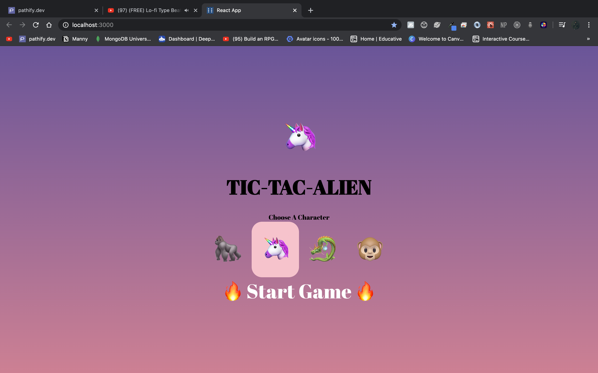
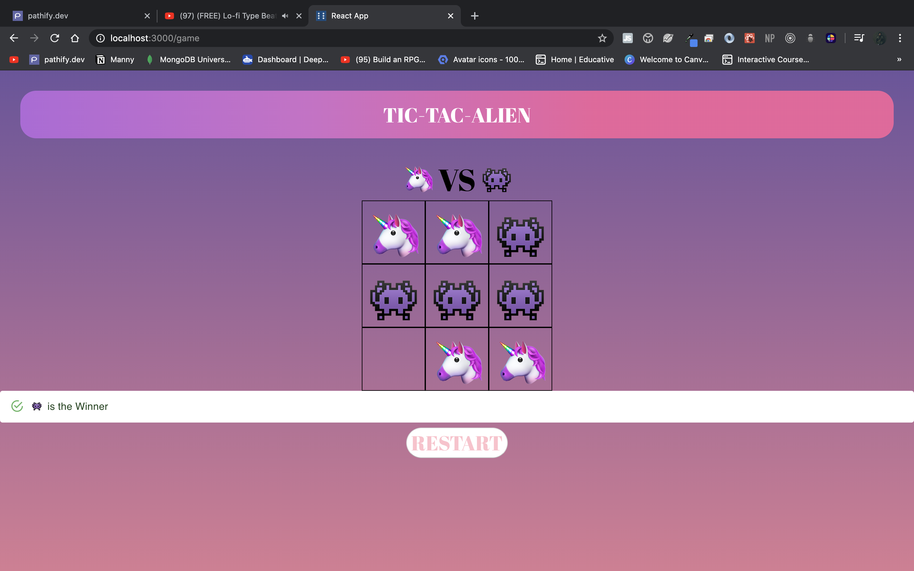

### Tic Tac Alien
Small personal project to keep working on React skills. 

### Getting Started
These instructions will get you a copy of the project up and running on your local machine for development and testing purposes.

Run npm install/yarn install followed by npm start/yarn start. Accept to listen to FE on port 3000

### Flow for user.

## Home
### Select a character.

## Game
### Game

### Prerequisites
 npm/yarn

### Built With
React - FrontEnd

### Authors
Manider Dheer.

### License
This project is licensed under the MIT License - see the LICENSE.md file for details

